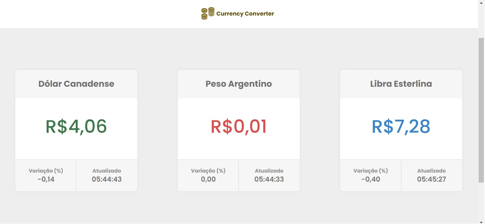
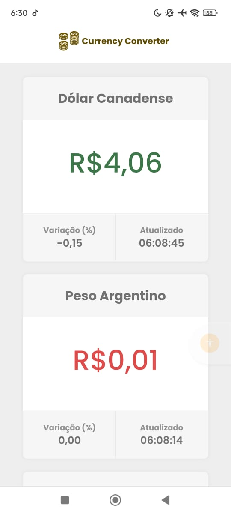

# Conversor de Moeda

## Visão Geral

Este é um aplicativo web simples que converte moedas em tempo real. Ele foi desenvolvido utilizando **React** para a interface e está hospedado em um contêiner **Docker** com **Nginx** servindo os arquivos estáticos.

---

## Pré-requisitos

- [Docker](https://docs.docker.com/get-docker/)
- [Docker Compose](https://docs.docker.com/compose/install/)

Certifique-se de ter estas ferramentas instaladas antes de seguir as instruções.

---

## Variáveis de Ambiente

Antes de iniciar, você precisará configurar as variáveis de ambiente. Crie um arquivo `.env` na raiz do projeto com as seguintes variáveis:

```bash
REACT_APP_API_URL=https://api.exchangerate-api.com
REACT_APP_API_KEY=sua-chave-api
```

---

## Como Rodar o Projeto

### 1. Clonar o repositório

```bash
git clone git@github.com:Luiz0tavi0/Cotacao-de-Moeda.git
cd Cotacao-de-Moeda
```

### 2. Construir e rodar o contêiner Docker

```bash
docker-compose up --build
```

O comando acima irá criar e iniciar o contêiner Docker. O aplicativo estará disponível em `http://localhost`.

### 3. Acessar o Aplicativo

Abra o navegador e acesse:

```bash
http://localhost
```

ou

[Site] (<https://currency-conversor-summer-feather-1268.fly.dev>)

---

## Como Usar

### Conversão de Moedas

- A aplicação exibe a cotação de 3 moedas em relação ao real do Brasil (BRL).
  - Dólar Canadense (CAD)
  - Peso Argentino (ARS)
  - Libra Esterlina (GBP)
- Exibe a hora da última atualização.
- Exibe a varição percentual da cotação atual.
- A aplicação mantém em cache local os dados e os atualiza a cada 3 minutos.

---

## Demonstração

### Imagens do Projeto

#### Desktop

[](<https://currency-conversor-summer-feather-1268.fly.dev>)

#### Mobile

[](<https://currency-conversor-summer-feather-1268.fly.dev>)

---

## Tecnologias Utilizadas

- **React**: Biblioteca JavaScript para construir interfaces de usuário.
- **Vite**: Ferramenta de build rápida para desenvolvimento frontend.
- **Docker**: Containerização para facilitar o deploy e a execução do projeto.
- **Nginx**: Servidor web para servir os arquivos estáticos do React.

---

## Contribuições

Se você quiser contribuir com este projeto, fique à vontade para enviar um pull request. Qualquer melhoria ou correção de bugs será bem-vinda!

---

## Licença

Este projeto está licenciado sob a [MIT License](https://github.com/Luiz0tavi0/-Conversor-de-Moeda-/blob/main/LICENSE).
